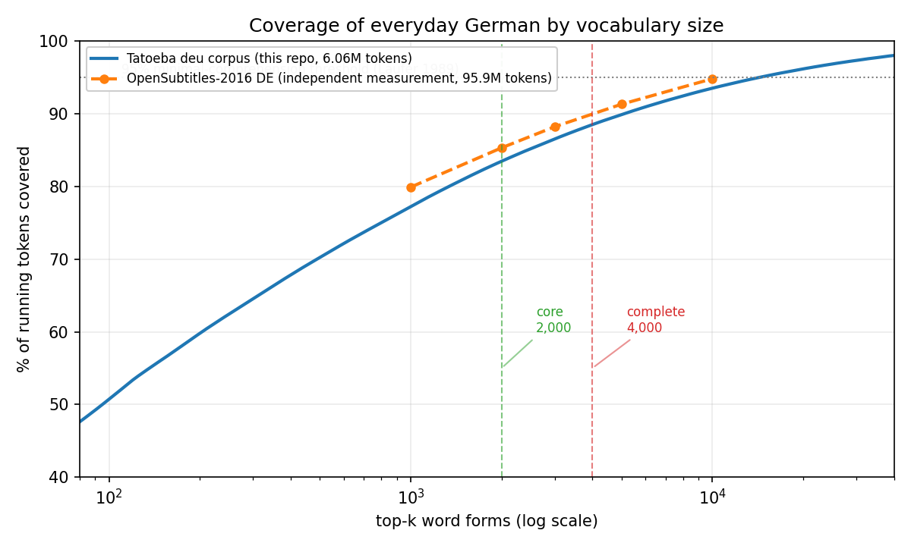
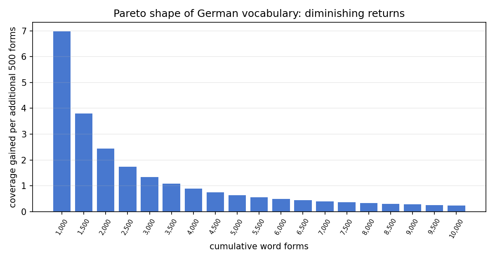
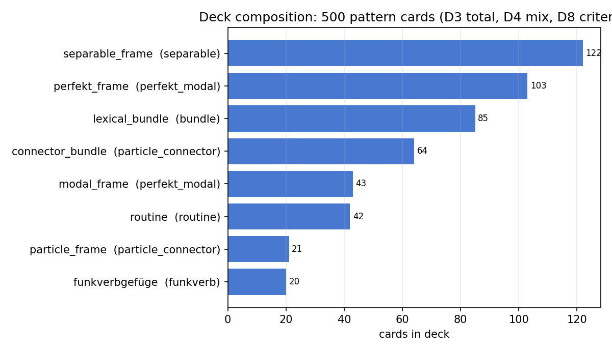
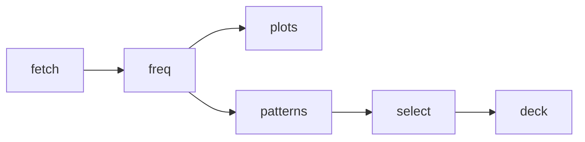

# german-pareto-deck

An evidence-sized German Anki deck. It teaches the Pareto-optimal core vocabulary inside the highest-frequency sentence patterns. Every number is measured or cited. Nothing is arbitrary.

Status: **v0.1 released**.

## Start here

1. Download `german-pareto-deck.apkg` from [Releases](https://github.com/gbrlpzz/german-pareto-deck/releases/latest).
2. In Anki: **File -> Import**.
3. Study **German Pareto::Core** first (1,507 cards). This is the steep part of the curve.
4. Add **German Pareto::Patterns** (461 cards) from day one. Chunks make words stick.
5. Start **German Pareto::Extension** when Core feels easy.

All cards carry tags (`core`, `ext`, rank bands, pattern classes). Suspend freely. Card order does not matter.

## Why this design

Isolated word lists teach poorly. Everyday language is doubly concentrated:

1. A few thousand word forms cover most speech.
2. About half of running speech is formulaic. Erman & Warren (2003) measured ~55%.

This deck teaches both at once. Each word sits inside a high-frequency pattern. Each pattern gets its own card.

**Words.** We measured coverage on two corpora: OpenSubtitles-2016 German (95.9M tokens, measured independently for this project) and Tatoeba German (6.06M tokens, this repo). Both curves agree with the research (Adolphs & Schmitt 2003; Nation 2006; Laufer 1989). The steepest gains end near 2,000 forms. The ~95% line - where guessing from context starts to work - falls between 3,000 and 4,000 lemmas.

**Patterns.** The PHRASE List (Martinez & Schmitt 2012) holds 505 items. Bundle research shows the most recurring sequences in conversation (Biber et al. 1999). So ~500 pattern cards is the strong tier. The deck favors spoken-German frames: Perfekt brackets, separable-verb brackets, modals, collocations, modal particles, routines.

**Cards.** Production beats recognition in both directions (Webb 2009). Context beats isolated pairs. So every card is a cloze-deleted authentic sentence, not a translation pair.

| Layer | Size | Outcome |
|---|---|---|
| Core words | top **2,000** lemmas | ~90% of everyday tokens |
| Complete words | ranks **2,001-4,000** | crosses the ~95% line |
| Patterns | **~500** cards | PHRASE-List scale |



*Figure 1. Token coverage by form rank on two corpora. Dashed verticals mark the cutoffs. The Tatoeba curve reads lower at equal rank. The bracket is deliberate.*



*Figure 2. Extra coverage per additional 500 forms. This is the case for stopping at 4,000.*

## What is in the deck

v0.1 ships **3,425 cards**:

- **2,963 word cards** (1,507 core / 1,456 extension). Front: English cue plus the example with the target blanked. Back: German form, full sentence, English gloss, and the authentic translation when available. Lemmas are grouped by a rule-based lemmatizer. Cards carry tier and rank-band tags.
- **461 pattern cards**. The pattern is cloze-deleted inside one authentic Tatoeba sentence, with its English translation. 500 patterns are selected (Figure 3). 39 are dropped at build time, with a counted reason: the sentence could not host the cloze.
- Tags: tier, rank band, pattern group, class. Suspend anything at any time.



*Figure 3. The final pattern mix. Literature allocation, data availability, documented redistribution. Trace: `derived/selection_summary.json`.*

## Reproduce



```bash
python3 -m venv .venv && .venv/bin/pip install -r requirements.txt
.venv/bin/python src/pipeline.py fetch       # downloads corpora, prints sha256
.venv/bin/python src/pipeline.py freq        # -> derived/top_forms.csv
.venv/bin/python src/pipeline.py patterns    # -> derived/patterns.csv (D8 criteria)
.venv/bin/python src/select_patterns.py      # -> derived/patterns_selected.csv (500)
.venv/bin/python src/lemmatize.py            # -> derived/lemma_groups.csv
.venv/bin/python src/words.py                # -> derived/wordlist.csv
.venv/bin/python src/sentences.py            # -> derived/word_sentences.csv
.venv/bin/python src/translations.py         # -> derived/translations.csv
.venv/bin/python src/glosses.py              # -> derived/glosses.csv (slow, rate-limit aware)
.venv/bin/python src/deck.py                 # -> out/german-pareto-deck.apkg
.venv/bin/python src/plots.py                # regenerates all figures
```

Tests:

```bash
.venv/bin/python -m unittest test_pipeline -v
.venv/bin/python test_lemmatize.py
```

## Documents

| Document | Content |
|---|---|
| [docs/METHODOLOGY.md](docs/METHODOLOGY.md) | Full method: terms, measured tables, citations, decision log D1-D8, selection registry, limitations |
| [docs/ROADMAP.md](docs/ROADMAP.md) | Prioritized follow-ups, each tied to a documented limitation |
| [docs/DATA_SOURCES.md](docs/DATA_SOURCES.md) | Provenance: URLs, dates, sha256, licenses |
| [LICENSE_NOTE.md](LICENSE_NOTE.md) | Code vs derived data vs upstream corpus |

## Repository layout

```
├── docs/
│   ├── METHODOLOGY.md        # method, evidence, decision log
│   ├── ROADMAP.md            # planned work
│   ├── DATA_SOURCES.md       # provenance + sha256
│   └── figures/              # generated plots
├── src/                      # pipeline stages + plots
├── derived/                  # tracked, inspectable artifacts
├── data/                     # gitignored corpus cache
└── out/                      # built deck (gitignored)
```

## License

Code: MIT. Generated lists: attributable derivatives of the cited sources. Raw corpora are not redistributed. The pipeline refetches them and records checksums.
