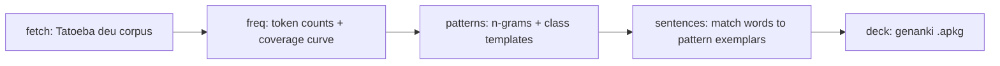

# german-pareto-deck

> **Suggested GitHub description:** German Anki deck sized by evidence — the Pareto-optimal core vocabulary taught inside the highest-frequency sentence patterns. Reproducible pipeline, every number traced to its source.

Status: **work in progress** — methodology and data layer done; pattern extraction and deck build active.

## The idea

Frequency decks teach isolated word↔translation pairs. Real comprehension runs on two Pareto curves:

1. **Words**: a few thousand lemmas cover most everyday speech.
2. **Patterns**: roughly half of running speech is formulaic — chunks like *Hast du …?*, *ich muss los*, *eine Entscheidung treffen*.

This repo builds ONE deck that teaches both together: each word appears inside a high-frequency pattern; each pattern is a card of its own.

## Headline numbers (why these sizes)

| Layer | Size | Rationale |
|---|---|---|
| Core words | top **2,000** lemmas | ~90% of subtitle tokens; steepest return |
| Extension words | ranks **2,001–4,000** | crosses the ~95% minimal-comprehension line |
| Patterns | **~500** cards | PHRASE-List scale; >1,000 shows diminishing returns |

Full reasoning, measurements and citations: **[docs/METHODOLOGY.md](docs/METHODOLOGY.md)** · provenance: **[docs/DATA_SOURCES.md](docs/DATA_SOURCES.md)**

## Pipeline



## Reproduce

```bash
python3 -m venv .venv && .venv/bin/pip install -r requirements.txt
.venv/bin/python src/pipeline.py fetch     # downloads corpora (~20 MB), records sha256
.venv/bin/python src/pipeline.py freq      # rebuilds derived/top_forms.csv + coverage_curve.csv
.venv/bin/python src/pipeline.py patterns  # WIP
.venv/bin/python src/pipeline.py deck      # WIP -> out/german-pareto-deck.apkg
```

## License

Code: Apache-2.0. Generated lists: attributable derivatives. Raw corpora stay with their owners (CC BY for Tatoeba) — see docs/.
