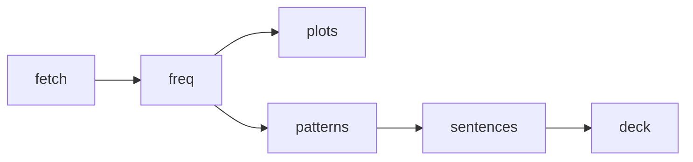

# german-pareto-deck

> **Suggested GitHub description:** German Anki deck sized by evidence — the Pareto-optimal core vocabulary taught inside the highest-frequency sentence patterns. Reproducible pipeline, every number traced to its source.

Status: **work in progress** — data layer and methodology complete; pattern extraction and deck assembly active.

## Scientific overview

Learning vocabulary as isolated pairs is inefficient because everyday language is doubly
concentrated: a few thousand word forms cover most running speech, and roughly half of
running speech is formulaic (Erman & Warren 2003 measure ~55% of discourse as prefabricated
chunks). This project builds a single Anki deck that exploits both concentrations at once.

**Words.** Token coverage was measured directly on primary corpus data — an independent
95.9M-token OpenSubtitles German sample and this repo's own 6.06M-token Tatoeba sample —
then anchored against spoken-language vocabulary research (Adolphs & Schmitt 2003; Nation
2006; Laufer 1989). The two curves bracket the truth and agree with the literature: the
steepest gains end near 2,000 forms, and the ~95% minimal-comprehension line (above which
context guessing becomes feasible) falls between 3,000 and 4,000 lemmas once German
inflection is accounted for.

**Patterns.** List-scale evidence — the 505-item PHRASE List (Martinez & Schmitt 2012) and
lexical-bundle research showing conversation is the densest register for recurring sequences
(Biber et al. 1999) — supports ~500 pattern cards as the strong tier, weighted toward
spoken-German frames: Perfekt brackets, separable-verb Satzklammer, modal constructions,
collocations and Funktionsverbgefüge, modal particles, conversational routines.

**Cards.** Production practice outperforms recognition in both directions (Webb 2009) and
contextualized retrieval beats isolated pairs, so every card is a cloze-deleted authentic
sentence rather than a translation pair.

| Layer | Size | Outcome |
|---|---|---|
| Core words | top **2,000** lemmas | ~90% of everyday tokens; steepest Pareto return |
| Complete words | ranks **2,001–4,000** | crosses the ~95% comprehension line |
| Patterns | **~500** cards | PHRASE-List scale; >1,000 shows diminishing returns |


*Figure 1. Token coverage by form rank on two independent corpora; dashed verticals mark the
adopted cutoffs. The Tatoeba curve reads lower at equal rank (translated, noun-heavier
register); the bracket is deliberate conservatism.*


*Figure 2. Diminishing marginal returns per additional 500 forms — the quantitative case for
stopping at 4,000 instead of marching to 10,000+.*

## What the deck teaches

- **Word cards** — production direction: English cue plus example sentence with the target
  blanked; the back shows the German form, the completed sentence, a chunk gloss, and (when
  available) the authentic English translation.
- **Pattern cards** — the pattern is cloze-deleted inside one authentic Tatoeba sentence;
  recognition reverses are reserved for modal particles and routines.
- Tags encode tier (`core` / `ext`) and pattern class, so anything can be suspended selectively.

## Companion documents

| Document | Content |
|---|---|
| [docs/METHODOLOGY.md](docs/METHODOLOGY.md) | Full method: definitions, measured tables, literature anchors, decision log D1–D7, limitations |
| [docs/DATA_SOURCES.md](docs/DATA_SOURCES.md) | Provenance: URLs, fetch dates, sha256 checksums, licenses |
| [LICENSE_NOTE.md](LICENSE_NOTE.md) | What is code vs derived data vs upstream corpus |

## Pipeline & reproduction



```bash
python3 -m venv .venv && .venv/bin/pip install -r requirements.txt
.venv/bin/python src/pipeline.py fetch     # re-downloads corpora, prints sha256
.venv/bin/python src/pipeline.py freq      # -> derived/top_forms.csv
.venv/bin/python src/plots.py              # regenerates every figure in docs/figures
# WIP: patterns / sentences / deck stages -> out/german-pareto-deck.apkg
```

## Repository layout

```
├── docs/
│   ├── METHODOLOGY.md        # method, evidence, decision log
│   ├── DATA_SOURCES.md       # provenance + sha256
│   └── figures/              # generated plots
├── src/
│   ├── pipeline.py           # fetch · freq · patterns · sentences · deck
│   └── plots.py              # figure generation
├── derived/                  # tracked, inspectable artifacts
├── data/                     # gitignored corpus cache
└── out/                      # built deck (gitignored)
```

## License

Code: Apache-2.0. Generated lists are attributable derivatives of the cited sources. Raw
corpora are never redistributed — the pipeline refetches them and records checksums.
