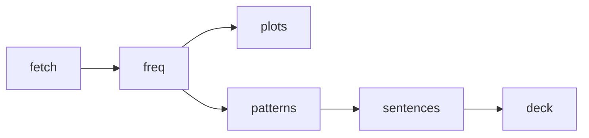

# german-pareto-deck

An evidence-sized German Anki deck: the Pareto-optimal core vocabulary, taught inside the highest-frequency sentence patterns. Every number is measured or cited — nothing is arbitrary.

Status: **v0.1 released**.

## Start here

1. Download `german-pareto-deck.apkg` from [Releases](https://github.com/gbrlpzz/german-pareto-deck/releases/latest).
2. In Anki: **File → Import**.
3. Study **German Pareto::Core** (1,507 cards) first — it is the steep part of the curve.
4. Add **German Pareto::Patterns** (461 cards) from day one; chunks make the words stick.
5. Take **German Pareto::Extension** when Core feels easy.

Everything is tagged (`core`, `ext`, rank bands, pattern classes) — suspend freely, the
deck does not depend on card order.

## Scientific overview

Learning vocabulary as isolated pairs is inefficient because everyday language is doubly
concentrated: a few thousand word forms cover most running speech, and roughly half of
running speech is formulaic (Erman & Warren 2003 measure ~55% of discourse as prefabricated
chunks). This project builds a single Anki deck that exploits both concentrations at once.

**Words.** Token coverage was measured directly on primary corpus data — an independent
95.9M-token OpenSubtitles German sample and this repo's own 6.06M-token Tatoeba sample —
then anchored against spoken-language vocabulary research (Adolphs & Schmitt 2003; Nation
2006; Laufer 1989). The two curves bracket the truth and agree with the literature: the
steepest gains end near 2,000 forms, and the ~95% minimal-comprehension line (above which
context guessing becomes feasible) falls between 3,000 and 4,000 lemmas once German
inflection is accounted for.

**Patterns.** List-scale evidence — the 505-item PHRASE List (Martinez & Schmitt 2012) and
lexical-bundle research showing conversation is the densest register for recurring sequences
(Biber et al. 1999) — supports ~500 pattern cards as the strong tier, weighted toward
spoken-German frames: Perfekt brackets, separable-verb Satzklammer, modal constructions,
collocations and Funktionsverbgefüge, modal particles, conversational routines.

**Cards.** Production practice outperforms recognition in both directions (Webb 2009) and
contextualized retrieval beats isolated pairs, so every card is a cloze-deleted authentic
sentence rather than a translation pair.

| Layer | Size | Outcome |
|---|---|---|
| Core words | top **2,000** lemmas | ~90% of everyday tokens; steepest Pareto return |
| Complete words | ranks **2,001–4,000** | crosses the ~95% comprehension line |
| Patterns | **~500** cards | PHRASE-List scale; >1,000 shows diminishing returns |


*Figure 1. Token coverage by form rank on two independent corpora; dashed verticals mark the
adopted cutoffs. The Tatoeba curve reads lower at equal rank (translated, noun-heavier
register); the bracket is deliberate conservatism.*


*Figure 2. Diminishing marginal returns per additional 500 forms — the quantitative case for
stopping at 4,000 instead of marching to 10,000+.*

## What the deck teaches

v0.1 ships **3,425 cards**:

- **2,963 word cards** (1,507 core / 1,456 extension) — production direction: English cue
  plus example sentence with the target blanked; the back shows the German form, the
  completed sentence, a best-effort English gloss, and (when available) the authentic
  English translation. Lemma-grouped (rule-based lemmatizer), tagged by tier and rank band.
- **461 pattern cards** — the pattern cloze-deleted inside one authentic Tatoeba sentence
  with its English translation. 500 patterns are selected (Fig. 3); 39 are dropped at build
  time with explicit accounting when the authentic sentence cannot host the cloze.
- Tags encode tier (`core` / `ext`), rank band, pattern group and class, so anything can be
  suspended selectively.


*Figure 3. Final pattern mix: the D4 literature allocation after D8-significant candidate
availability and documented redistribution (trace: `derived/selection_summary.json`).*

## Roadmap

See [docs/ROADMAP.md](docs/ROADMAP.md) — prioritized follow-ups, each tied to a documented
limitation. Nothing blocks daily use.

## Companion documents

| Document | Content |
|---|---|
| [docs/METHODOLOGY.md](docs/METHODOLOGY.md) | Full method: definitions, measured tables, literature anchors, decision log D1–D7, limitations |
| [docs/DATA_SOURCES.md](docs/DATA_SOURCES.md) | Provenance: URLs, fetch dates, sha256 checksums, licenses |
| [LICENSE_NOTE.md](LICENSE_NOTE.md) | What is code vs derived data vs upstream corpus |

## Pipeline & reproduction



```bash
python3 -m venv .venv && .venv/bin/pip install -r requirements.txt
.venv/bin/python src/pipeline.py fetch       # re-downloads corpora, prints sha256
.venv/bin/python src/pipeline.py freq        # -> derived/top_forms.csv
.venv/bin/python src/pipeline.py patterns    # -> derived/patterns.csv (D8 criteria)
.venv/bin/python src/select_patterns.py      # -> derived/patterns_selected.csv (500)
.venv/bin/python src/lemmatize.py            # -> derived/lemma_groups.csv
.venv/bin/python src/words.py                # -> derived/wordlist.csv
.venv/bin/python src/sentences.py            # -> derived/word_sentences.csv
.venv/bin/python src/translations.py         # -> derived/translations.csv
.venv/bin/python src/glosses.py              # -> derived/glosses.csv (best-effort, slow)
.venv/bin/python src/deck.py                 # -> out/german-pareto-deck.apkg
.venv/bin/python src/plots.py                # regenerates every figure in docs/figures
```

Tests:

```bash
.venv/bin/python -m unittest test_pipeline -v
.venv/bin/python test_lemmatize.py
```

## Repository layout

```
├── docs/
│   ├── METHODOLOGY.md        # method, evidence, decision log
│   ├── DATA_SOURCES.md       # provenance + sha256
│   └── figures/              # generated plots
├── src/
│   ├── pipeline.py           # fetch · freq · patterns · sentences · deck
│   └── plots.py              # figure generation
├── derived/                  # tracked, inspectable artifacts
├── data/                     # gitignored corpus cache
└── out/                      # built deck (gitignored)
```

## License

Code: MIT. Generated lists are attributable derivatives of the cited sources. Raw
corpora are never redistributed — the pipeline refetches them and records checksums.
