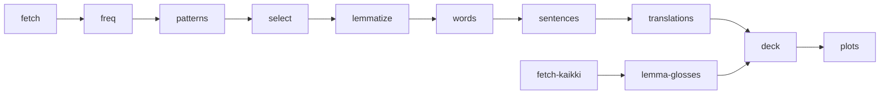

# german-pareto-deck

A German Anki deck with high-frequency words and sentence patterns.

Status: **v0.2 released**.

## Start here

1. Download `german-pareto-deck.apkg` from [Releases](https://github.com/gbrlpzz/german-pareto-deck/releases/latest).
2. In Anki: **File -> Import**.
3. Study **German Pareto::Core** first (1,507 word cards).
4. Add **German Pareto::Patterns** (562 cards) from day one. It has 500 cloze cards and 62 recognition cards.
5. Start **German Pareto::Extension** when Core feels easy.

All cards carry tags (`core`, `ext`, rank bands, pattern classes). Suspend freely. Card order does not matter.

## Why this design

Isolated word lists teach poorly. Everyday language is doubly concentrated:

1. A few thousand word forms cover most speech.
2. About half of running speech is formulaic. Erman & Warren (2003) measured ~55%.

This deck teaches both at once. Each word sits inside a high-frequency pattern. Each pattern gets its own card.

**Words.** We measured coverage on two corpora: OpenSubtitles-2016 German (95.9M tokens, measured independently for this project) and Tatoeba German (6.06M tokens, this repo). Both curves agree with the research (Adolphs & Schmitt 2003; Nation 2006; Laufer 1989). The steepest gains end near 2,000 forms. The ~95% line - where guessing from context starts to work - falls between 3,000 and 4,000 lemmas.

**Patterns.** The PHRASE List (Martinez & Schmitt 2012) holds 505 items. Bundle research shows the most recurring sequences in conversation (Biber et al. 1999). This deck has 500 pattern cards. It favors spoken-German frames: Perfekt brackets, separable-verb brackets, modals, collocations, modal particles, and routines.

**Cards.** Production beats recognition in both directions (Webb 2009). Context beats isolated pairs. Word cards use production. Pattern cards use cloze production. Routine and particle patterns also have recognition cards.

| Layer | Size | Outcome |
|---|---|---|
| Core words | top **2,000** forms, grouped into 1,507 lemmas | main deck |
| Extension words | ranks **2,001-4,000** | optional second band |
| Pattern cloze cards | **500** | PHRASE-List scale |
| Pattern recognition cards | **62** | routines and modal particles |


*Figure 1. Token coverage by form rank on two corpora. Dashed verticals mark the cutoffs.*


*Figure 2. Extra coverage per additional 500 forms.*

## What is in the deck

v0.2 ships **3,525 cards**:

- **2,963 word cards** (1,507 core / 1,456 extension). The front has an English cue and an example with the target blanked. The back has the German form, full sentence, English gloss, and authentic translation when available. The deck uses a rule-based lemmatizer. Lemma-level glosses come from the Kaikki German Wiktionary extract. Form-of redirects cover residual inflected forms. 26 cards have no dictionary gloss; they are mostly names or corpus-specific items.
- **500 pattern cloze cards**. Each pattern is cloze-deleted inside one authentic Tatoeba sentence. All 500 selected patterns now have a cloze exemplar.
- **62 pattern recognition cards**. These cover 42 routines and 20 modal-particle frames. The front shows the German chunk in context. The back shows the English translation.
- Tags: tier, rank band, pattern group, class. Suspend anything at any time.


*Figure 3. The final pattern mix. The source is `derived/selection_summary.json`.*

## Reproduce

The stages are separate. Run them in this order:



```bash
python3 -m venv .venv && .venv/bin/pip install -r requirements.txt
.venv/bin/python src/pipeline.py fetch
.venv/bin/python src/pipeline.py freq
.venv/bin/python src/pipeline.py patterns
.venv/bin/python src/pipeline.py select
.venv/bin/python src/pipeline.py lemmatize
.venv/bin/python src/pipeline.py words
.venv/bin/python src/pipeline.py sentences
.venv/bin/python src/pipeline.py translations
.venv/bin/python src/pipeline.py fetch-kaikki       # 1 GB; optional source cache
.venv/bin/python src/pipeline.py lemma-glosses
.venv/bin/python src/pipeline.py deck
.venv/bin/python src/pipeline.py plots
```

`glosses.py` is an optional Wiktionary REST fallback for form-level glosses. It is slow and rate-limited:

```bash
.venv/bin/python src/pipeline.py glosses
```

Tests:

```bash
.venv/bin/python -m unittest test_pipeline test_deck test_glosses -v
.venv/bin/python test_lemmatize.py
```

## Documents

| Document | Content |
|---|---|
| [docs/METHODOLOGY.md](docs/METHODOLOGY.md) | Method, data, citations, decisions D1-D8, and limits |
| [docs/ROADMAP.md](docs/ROADMAP.md) | Completed v0.2 work and next steps |
| [docs/RELEASE_NOTES.md](docs/RELEASE_NOTES.md) | Release changes |
| [docs/DATA_SOURCES.md](docs/DATA_SOURCES.md) | URLs, dates, checksums, and licenses |
| [LICENSE_NOTE.md](LICENSE_NOTE.md) | Code, derived data, and upstream corpus licenses |

## Repository layout

```
├── docs/
│   ├── METHODOLOGY.md        # method, evidence, decisions
│   ├── ROADMAP.md            # completed and planned work
│   ├── RELEASE_NOTES.md      # release changes
│   ├── DATA_SOURCES.md       # provenance and sha256
│   └── figures/              # generated plots
├── src/                      # pipeline stages and plots
├── derived/                  # tracked, inspectable artifacts
├── data/                     # gitignored source cache
└── out/                      # built deck (gitignored)
```

## License

Code: MIT. Generated lists are attributable derivatives of the cited sources. Raw corpora are not redistributed. The pipeline downloads them and records checksums.
